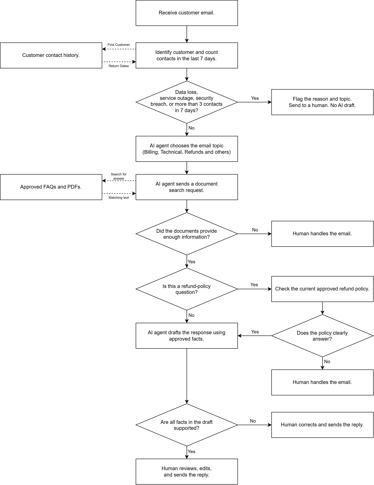

# Agentic Architect Challenge

## Part 1: Customer support email system

The system checks each email for urgent issues and repeated contacts before the AI drafts a reply. For other emails, it classifies the topic, searches approved FAQs and PDFs, and drafts a response using supported information. A human reviews, edits, and sends the reply.

Emails mentioning data loss, service outage, or a security breach, and customers with more than 3 contacts in 7 days, go to a human before any AI draft. Refund answers must use the approved policy; unclear cases go to a human.



## Part 2: Web summarizer

The script extracts a webpage’s main text with Trafilatura. If it finds fewer than 30 words, Playwright loads the page in Chromium and extraction is tried again. Long text is split into chunks and summarized with Gemini. The final summary is limited to 100 words.

### Run locally

Open a Windows Command Prompt in the repository folder:

```bat
cd part2
python -m venv .venv
.venv\Scripts\activate
python -m pip install -r requirements.txt
python -m playwright install chromium
python web_summarizer.py
```

Enter a webpage URL and your own Gemini API key when prompted. The key is hidden as you type.

To use the web interface instead, run this from the activated `part2` environment:

```bat
python -m streamlit run web_app.py
```

Enter the URL and your Gemini API key in the web page. An internet connection is required.

### Bottlenecks and fixes

- **JavaScript pages:** Trafilatura may miss text added after the page loads. If it finds fewer than 30 words, Playwright opens the page in a browser and extraction is tried again. A genuinely short page may trigger this step unnecessarily.
- **Long pages:** The text is split into smaller chunks. Gemini summarizes each chunk, then combines the results into no more than 100 words. Pages with many chunks may hit Gemini’s request limit.

Test pages: [Python About](https://www.python.org/about/) and [JavaScript Quotes](https://quotes.toscrape.com/js/). On the JavaScript Quotes page, normal extraction found 6 words; browser fallback found 189 words.

## Part 3: Document-based event assistant

The assistant answers questions using the [sample visitor guide](part3/sample_document.pdf). It remembers details such as the user’s name during the conversation. For questions about total ticket cost, it can call a calculator tool. If the document does not contain an answer, it says so.

### Run locally

Open a new Windows Command Prompt in the repository folder:

```bat
cd part3
python -m venv .venv
.venv\Scripts\activate
python -m pip install -r requirements.txt
python agent.py
```

Enter your own Gemini API key when prompted. To use the web interface instead, run this from the activated `part3` environment:

```bat
python -m streamlit run web_app.py
```

Enter your Gemini API key in the web page sidebar. An internet connection is required.

### Example checks

- Ask the price of one adult ticket. The assistant should answer RM25 without using the calculator.
- Ask for the total for 3 adults and 3 students. It should use the calculator and answer RM120.
- Tell it your name, then ask for your name later in the same conversation.
- Ask about the refund policy. It should say the document does not provide that information.

Conversation memory lasts for the current session. The calculator uses prices from this sample document, so its prices must be updated if the document changes.
